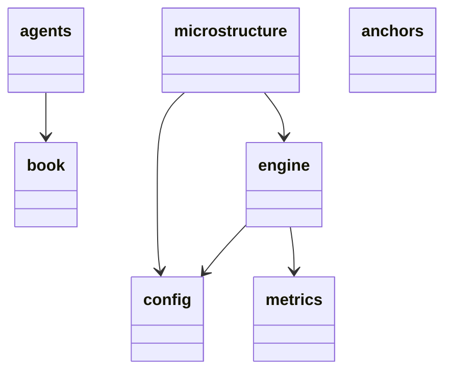
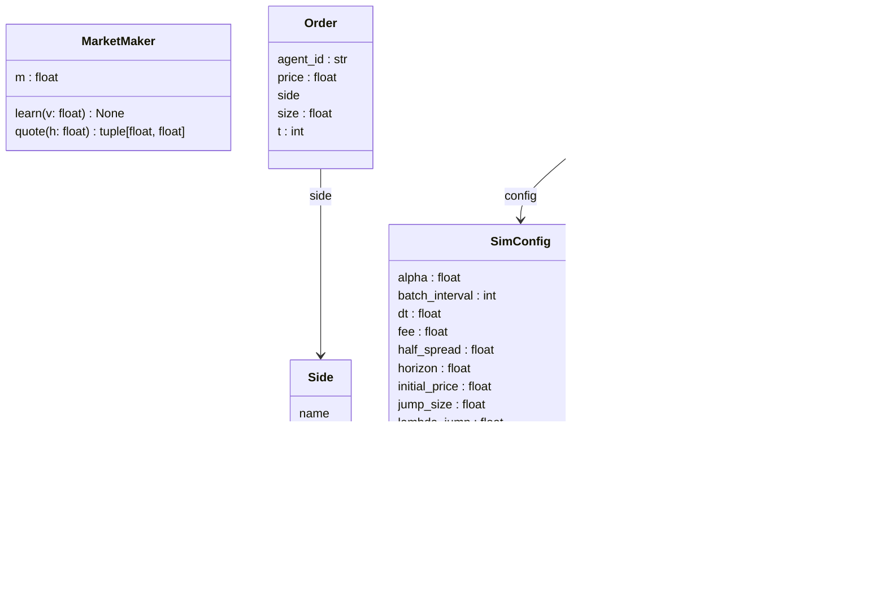

# Architecture (auto-generated)

## Packages

```mermaid
classDiagram
  class microstructure {
  }
  class agents {
  }
  class anchors {
  }
  class book {
  }
  class config {
  }
  class engine {
  }
  class metrics {
  }
  microstructure --> config
  microstructure --> engine
  agents --> book
  engine --> config
  engine --> metrics
```

## Classes

```mermaid
classDiagram
  class MarketMaker {
    m : float
    learn(v: float) None
    quote(h: float) tuple[float, float]
  }
  class Metrics {
    effective_spread : float
    extraction : float
    fees : float
    informed_impact : float
    mm_exits : bool
    mm_net_pnl : float
    mm_trading_pnl : float
    n_arb : int
    n_noise : int
    n_trades : int
    noise_pnl : float
    participation_margin : float
    price_impact : float
  }
  class Order {
    agent_id : str
    price : float
    side
    size : float
    t : int
  }
  class RunResult {
    config
    extraction_rate : float
    metrics
    runtime_sec : float
  }
  class Side {
    name
  }
  class SimConfig {
    alpha : float
    batch_interval : int
    dt : float
    fee : float
    half_spread : float
    horizon : float
    initial_price : float
    jump_size : float
    lambda_jump : float
    mechanism : Literal['continuous', 'batch']
    n_periods : int
    noise_rate : float
    opp_cost : float
    se_mult : float
    seed : int
    sigma : float
  }
  Order --> Side : side
  RunResult --> SimConfig : config
  RunResult --> Metrics : metrics
```
